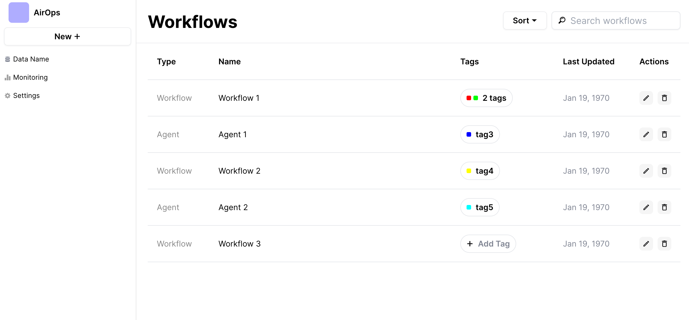

## Running the project

To run the project locally, you'll need to create a `.env` file at the root of the project with the following configuration (taken from your AirOps dashboard):

```
VITE_WORKSPACE_ID=...
VITE_USER_ID=...
VITE_API_KEY=...
VITE_EXECUTION_ID=...
```

then run

```bash
npm install
npm run dev
```

## Philosophy

The goal is to keep the project simple with no additional third party dependencies (outside what already came with the project).

## Warning

This sample project does not include a backend, so we make a request directly from the web client to the AirOps API. That means we're leaking our secret token.

## Screenshot

Below is a screenshot of the app


